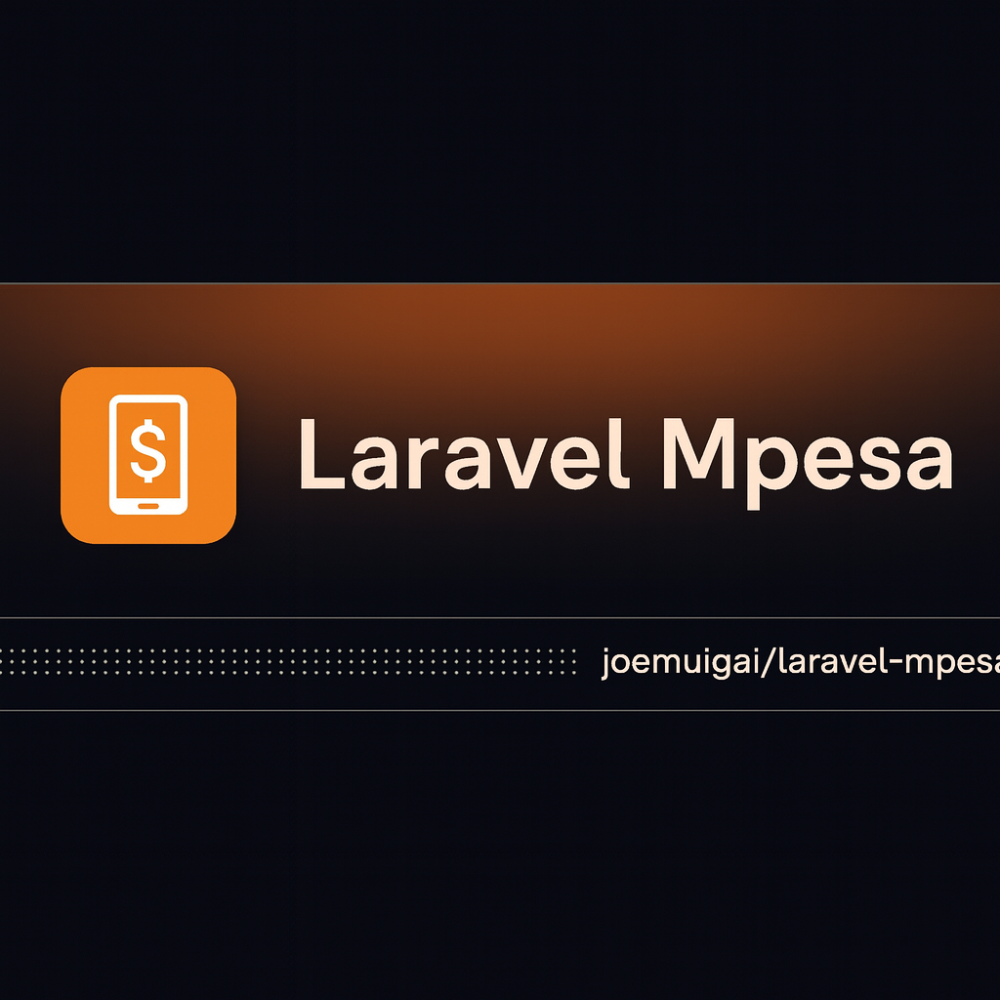

<!-- get laravel-mpesa png -->


[](https://packagist.org/packages/joemuigai/laravel-mpesa)
[](https://github.com/joemuigai/laravel-mpesa/actions?query=workflow%3Arun-tests+branch%3Amain)
[](https://github.com/joemuigai/laravel-mpesa/actions?query=workflow%3A"Fix+PHP+code+style+issues"+branch%3Amain)
[](https://packagist.org/packages/joemuigai/laravel-mpesa)

A Laravel package for integrating with **Safaricom M-Pesa (Daraja)**, focusing on:

- STK Push (M-Pesa Express)
- C2B (CustomerToBusiness RegisterURL)
- B2C (BusinessToCustomer)
- Transaction Status
- Pull Transaction

It is designed for both **single-merchant apps** and **multi-tenant/platforms** where each client onboards their own Daraja credentials.

## Installation

You can install the package via composer:

```bash
composer require joemuigai/laravel-mpesa
```

You can publish and run the migrations with:

```bash
php artisan vendor:publish --tag="laravel-mpesa-migrations"
php artisan migrate
```

You can publish the config file with:

```bash
php artisan vendor:publish --tag="laravel-mpesa-config"
```

This is the contents of the published config file:

```php
return [

    /*
    |--------------------------------------------------------------------------
    | Account Driver (single app vs multi-account platform)
    |--------------------------------------------------------------------------
    |
    | single   -> Use the credentials defined in this file / env.
    | database -> Load credentials per account (e.g. per tenant/merchant)
    |            from an Eloquent model that you control.
    |
    | For a SaaS/platform where each client onboards their own Daraja account:
    |   - Set MPESA_ACCOUNT_DRIVER=database
    |   - Point "model" to your MpesaAccount model.
    */

    'accounts' => [
        'driver' => env('MPESA_ACCOUNT_DRIVER', 'single'), // single|database

        // Only used when driver = database
        'model' => env('MPESA_ACCOUNT_MODEL', 'App\\Models\\MpesaAccount'),

        // Caching of loaded account credentials (in seconds)
        'cache_ttl' => env('MPESA_ACCOUNT_CACHE_TTL', 300),
    ],

    /*
    |--------------------------------------------------------------------------
    | Daraja App Credentials
    |--------------------------------------------------------------------------
    |
    | One Daraja app usually has one consumer key/secret and multiple APIs
    | (C2B, STK, B2C, etc.) enabled on it. So by default we keep credentials
    | in a single place.
    */

    'credentials' => [
        'consumer_key'    => env('MPESA_CONSUMER_KEY'),
        'consumer_secret' => env('MPESA_CONSUMER_SECRET'),
    ],

    /*
    |--------------------------------------------------------------------------
    | Mpesa Environment
    |--------------------------------------------------------------------------
    */

    'environment' => env('MPESA_ENVIRONMENT', 'sandbox'),

    /*
    |--------------------------------------------------------------------------
    | API Base URLs
    |--------------------------------------------------------------------------
    */

    'base_urls' => [
        'sandbox'    => env('MPESA_BASE_URL_SANDBOX', 'https://sandbox.safaricom.co.ke'),
        'production' => env('MPESA_BASE_URL_PRODUCTION', 'https://api.safaricom.co.ke'),
    ],

    /*
    |--------------------------------------------------------------------------
    | Collections (how customers pay you)
    |--------------------------------------------------------------------------
    |
    | This block models how money comes IN.
    */

    'collections' => [

        /*
         | mode:
         |   - 'buy_goods' → primarily using till numbers
         |   - 'paybill'   → primarily using paybill + account number
         |   - 'hybrid'    → both; your app chooses per transaction
         */
        'mode' => env('MPESA_COLLECTION_MODE', 'buy_goods'), // buy_goods|paybill|hybrid

        // Buy Goods (Till Numbers)
        'buy_goods' => [

            // Default till used when you don't explicitly choose one
            'default_till' => env('MPESA_BUY_GOODS_TILL', '174379'),

            /*
             | Optional static branch tills.
             |
             | For real platforms you’ll mirror tills in the database and
             | resolve them via the "database" account driver instead.
             */
            'tills' => [],
        ],

        // Paybill (Shortcode + Account Number)
        'paybill' => [

            // Main paybill shortcode
            'shortcode' => env('MPESA_PAYBILL_SHORTCODE', env('MPESA_BUSINESS_SHORTCODE')),

            /*
             | Default account reference when you are not generating a custom
             | account number per invoice/customer.
             */
            'default_account' => env('MPESA_PAYBILL_ACCOUNT'),
        ],
    ],

    /*
    |--------------------------------------------------------------------------
    | C2B (Customer → Business)
    |--------------------------------------------------------------------------
    |
    | C2B mostly cares about the shortcode and callback URLs. The access
    | token for C2B will come from the top-level "credentials".
    */

    'c2b' => [
        'shortcode' => env(
            'MPESA_C2B_SHORTCODE',
            env('MPESA_PAYBILL_SHORTCODE', env('MPESA_BUSINESS_SHORTCODE'))
        ),

        'validation_url'   => env('MPESA_C2B_VALIDATION_URL'),
        'confirmation_url' => env('MPESA_C2B_CONFIRMATION_URL'),

        /*
         | Used by the CustomerToBusinessRegisterURL API:
         |   - "Completed" → always send to your URLs
         |   - "Cancelled" → only failed transactions
         */
        'response_type' => env('MPESA_C2B_RESPONSE_TYPE', 'Completed'),
    ],

    /*
    |--------------------------------------------------------------------------
    | B2C (Business → Customer)
    |--------------------------------------------------------------------------
    |
    | Uses the top-level "credentials" for auth. Dynamic things like amount
    | and PartyB are passed per request.
    */

    'b2c' => [
        // Paybill/shortcode the funds are sent FROM (PartyA)
        'shortcode' => env(
            'MPESA_B2C_SHORTCODE',
            env('MPESA_PAYBILL_SHORTCODE', env('MPESA_BUSINESS_SHORTCODE'))
        ),

        /*
         | Default CommandID. Can be overridden per request.
         | Allowed (Daraja docs):
         |   - SalaryPayment
         |   - BusinessPayment
         |   - PromotionPayment
         */
        'command_id' => env('MPESA_B2C_COMMAND_ID', 'BusinessPayment'),

        // Where Safaricom sends B2C callbacks
        'result_url'  => env('MPESA_B2C_RESULT_URL'),
        'timeout_url' => env('MPESA_B2C_TIMEOUT_URL'),

        'defaults' => [
            'remarks'  => env('MPESA_B2C_DEFAULT_REMARKS', 'B2C Payment'),
            'occasion' => env('MPESA_B2C_DEFAULT_OCCASION'),
        ],

        'constraints' => [
            'remarks_max'  => 100,
            'occasion_max' => 100,
        ],
    ],

    /*
    |--------------------------------------------------------------------------
    | Transaction Status (Query API)
    |--------------------------------------------------------------------------
    |
    | Used to check status of a previous M-Pesa transaction.
    */

    'transaction_status' => [
        // Usually "TransactionStatusQuery"
        'command_id' => env('MPESA_TXN_STATUS_COMMAND_ID', 'TransactionStatusQuery'),

        // Who is asking about the transaction (shortcode or MSISDN)
        'party_a' => env(
            'MPESA_TXN_STATUS_PARTY_A',
            env('MPESA_PAYBILL_SHORTCODE', env('MPESA_BUSINESS_SHORTCODE'))
        ),

        /*
         | IdentifierType:
         |   1 = MSISDN
         |   2 = Till number
         |   4 = Shortcode
         */
        'identifier_type' => env('MPESA_TXN_STATUS_IDENTIFIER_TYPE', 4),

        'result_url'  => env('MPESA_STATUS_RESULT_URL'),
        'timeout_url' => env('MPESA_STATUS_TIMEOUT_URL'),

        'defaults' => [
            'remarks'  => env('MPESA_TXN_STATUS_DEFAULT_REMARKS', 'Transaction Status Query'),
            'occasion' => env('MPESA_TXN_STATUS_DEFAULT_OCCASION'),
        ],

        'constraints' => [
            'remarks_max'  => 100,
            'occasion_max' => 100,
        ],
    ],

    /*
    |--------------------------------------------------------------------------
    | Pull Transaction API
    |--------------------------------------------------------------------------
    |
    | Covers:
    |  - PullTransaction Register URL
    |  - PullTransaction Query (date range is per-call).
    */

    'pull' => [
        // ShortCode whose transactions you’re pulling
        'shortcode' => env(
            'MPESA_PULL_SHORTCODE',
            env('MPESA_PAYBILL_SHORTCODE', env('MPESA_BUSINESS_SHORTCODE'))
        ),

        'register' => [
            // Value as per Daraja docs
            'request_type'     => env('MPESA_PULL_REQUEST_TYPE'),
            // MSISDN in 2547XXXXXXXX format
            'nominated_number' => env('MPESA_PULL_NOMINATED_MSISDN'),
            // Where Safaricom sends notifications for the Pull API
            'callback_url'     => env('MPESA_PULL_CALLBACK_URL', env('MPESA_CALLBACK_URL')),
        ],
    ],

    /*
    |--------------------------------------------------------------------------
    | STK Push (Lipa na Mpesa Online)
    |--------------------------------------------------------------------------
    */

    'stk' => [
        // BusinessShortCode / Till used by default for STK
        'shortcode' => env(
            'MPESA_STK_SHORTCODE',
            env('MPESA_BUSINESS_SHORTCODE', '174379')
        ),

        // STK Passkey (used to build Password = base64(shortcode + passkey + timestamp))
        'passkey' => env('MPESA_STK_PASSKEY', env(
            'SAFARICOM_PASSKEY',
            // Official sandbox passkey; do NOT use in production
            'bfb279f9aa9bdbcf158e97dd71a467cd2e0c893059b10f78e6b72ada1ed2c919'
        )),

        // Where Safaricom sends STK results
        'callback_url' => env('MPESA_STK_CALLBACK_URL', env('MPESA_CALLBACK_URL')),

        // Default TransactionType values (can be overridden per call)
        'transaction_types' => [
            'paybill'   => env('MPESA_STK_TYPE_PAYBILL', 'CustomerPayBillOnline'),
            'buy_goods' => env('MPESA_STK_TYPE_BUY_GOODS', 'CustomerBuyGoodsOnline'),
        ],

        'defaults' => [
            'account_reference' => env('MPESA_STK_DEFAULT_ACCOUNT_REF'),
            'transaction_desc'  => env('MPESA_STK_DEFAULT_DESC', 'Payment'),
        ],

        'constraints' => [
            'account_reference_max' => 12,  // per Daraja docs
            'transaction_desc_max'  => 13,  // per Daraja docs
        ],
    ],

    /*
    |--------------------------------------------------------------------------
    | Legacy Till Shortcut (for backwards compatibility)
    |--------------------------------------------------------------------------
    */

    'till_number' => env('MPESA_BUY_GOODS_TILL', '174379'),

    /*
    |--------------------------------------------------------------------------
    | Initiator Credentials (B2C / B2B / Reversals / Balance / Status)
    |--------------------------------------------------------------------------
    */

    'initiator' => [
        'name'     => env('MPESA_INITIATOR_NAME', 'testapi'),
        'password' => env('MPESA_INITIATOR_PASSWORD'),
    ],

    /*
    |--------------------------------------------------------------------------
    | Callback URLs (grouped by API)
    |--------------------------------------------------------------------------
    */

    'callbacks' => [
        'default' => env('MPESA_CALLBACK_URL'),

        'c2b' => [
            'validation'   => env('MPESA_C2B_VALIDATION_URL'),
            'confirmation' => env('MPESA_C2B_CONFIRMATION_URL'),
        ],

        'b2c' => [
            'result'  => env('MPESA_B2C_RESULT_URL'),
            'timeout' => env('MPESA_B2C_TIMEOUT_URL'),
        ],

        'status' => [
            'result'  => env('MPESA_STATUS_RESULT_URL'),
            'timeout' => env('MPESA_STATUS_TIMEOUT_URL'),
        ],

        'balance' => [
            'result'  => env('MPESA_BALANCE_RESULT_URL'),
            'timeout' => env('MPESA_BALANCE_TIMEOUT_URL'),
        ],

        'reversal' => [
            'result'  => env('MPESA_REVERSAL_RESULT_URL'),
            'timeout' => env('MPESA_REVERSAL_TIMEOUT_URL'),
        ],

        'b2b' => [
            'result'  => env('MPESA_B2B_RESULT_URL'),
            'timeout' => env('MPESA_B2B_TIMEOUT_URL'),
        ],
    ],

    /*
    |--------------------------------------------------------------------------
    | Safaricom Gateway IP Whitelist (for callbacks)
    |--------------------------------------------------------------------------
    */

    'gateway_ips' => [
        'enabled' => env('MPESA_GATEWAY_IP_CHECK', true),

        'ips' => array_filter(
            array_map(
                'trim',
                explode(
                    ',',
                    env('MPESA_GATEWAY_IPS', implode(',', [
                        '196.201.214.200',
                        '196.201.214.206',
                        '196.201.213.114',
                        '196.201.214.207',
                        '196.201.214.208',
                        '196.201.213.44',
                        '196.201.212.127',
                        '196.201.212.138',
                        '196.201.212.129',
                        '196.201.212.136',
                        '196.201.212.74',
                        '196.201.212.69',
                    ]))
                )
            )
        ),
    ],

    /*
    |--------------------------------------------------------------------------
    | Security Credentials (certificates for Initiator password encryption)
    |--------------------------------------------------------------------------
    |
    | These default to the certificates bundled with this package:
    |   vendor/joemuigai/laravel-mpesa/src/Certificates/*.cer
    |
    | If you really need custom certs, override via:
    |   MPESA_CERT_SANDBOX_PATH / MPESA_CERT_PRODUCTION_PATH
    */

    'security' => [
        'certificates' => [
            'sandbox' => env(
                'MPESA_CERT_SANDBOX_PATH',
                base_path('vendor/joemuigai/laravel-mpesa/src/Certificates/SandboxCertificate.cer')
            ),

            'production' => env(
                'MPESA_CERT_PRODUCTION_PATH',
                base_path('vendor/joemuigai/laravel-mpesa/src/Certificates/ProductionCertificate.cer')
            ),
        ],

        // Cache generated SecurityCredential for this many seconds
        'cache_ttl' => env('MPESA_SECURITY_CREDENTIAL_CACHE_TTL', 3600),
    ],

    /*
    |--------------------------------------------------------------------------
    | HTTP Client Options
    |--------------------------------------------------------------------------
    */

    'http' => [
        'timeout'         => env('MPESA_HTTP_TIMEOUT', 30),
        'connect_timeout' => env('MPESA_HTTP_CONNECT_TIMEOUT', 10),
        'verify'          => env('MPESA_HTTP_VERIFY', true),
    ],

    /*
    |--------------------------------------------------------------------------
    | Logging
    |--------------------------------------------------------------------------
    */

    'logging' => [
        'enabled' => env('MPESA_LOG_ENABLED', true),
        'channel' => env('MPESA_LOG_CHANNEL'),
    ],
];

```

Copy and adapt the following to your .env file:

```bash
# Core Daraja app credentials
MPESA_CONSUMER_KEY=your_daraja_consumer_key
MPESA_CONSUMER_SECRET=your_daraja_consumer_secret
MPESA_ENVIRONMENT=sandbox        # or production

# Main shortcodes / tills
MPESA_BUSINESS_SHORTCODE=123456  # paybill or shortcode
MPESA_PAYBILL_SHORTCODE=123456
MPESA_BUY_GOODS_TILL=123456

# STK (M-Pesa Express)
MPESA_STK_PASSKEY=your_stk_passkey
MPESA_STK_CALLBACK_URL=${APP_URL}/mpesa/stk/callback

# Generic fallback callback
MPESA_CALLBACK_URL=${APP_URL}/mpesa/callback

# C2B (RegisterURL)
MPESA_C2B_SHORTCODE=${MPESA_PAYBILL_SHORTCODE}
MPESA_C2B_VALIDATION_URL=${APP_URL}/mpesa/c2b/validate
MPESA_C2B_CONFIRMATION_URL=${APP_URL}/mpesa/c2b/confirm
MPESA_C2B_RESPONSE_TYPE=Completed

# B2C (Business to Customer)
MPESA_INITIATOR_NAME=your_initiator_username
MPESA_INITIATOR_PASSWORD=your_initiator_password
MPESA_B2C_SHORTCODE=${MPESA_BUSINESS_SHORTCODE}
MPESA_B2C_RESULT_URL=${APP_URL}/mpesa/b2c/result
MPESA_B2C_TIMEOUT_URL=${APP_URL}/mpesa/b2c/timeout
MPESA_B2C_COMMAND_ID=BusinessPayment

# Transaction Status
MPESA_STATUS_RESULT_URL=${APP_URL}/mpesa/status/result
MPESA_STATUS_TIMEOUT_URL=${APP_URL}/mpesa/status/timeout

# Pull Transaction API
MPESA_PULL_SHORTCODE=${MPESA_BUSINESS_SHORTCODE}
MPESA_PULL_REQUEST_TYPE=PullTransaction
MPESA_PULL_NOMINATED_MSISDN=2547XXXXXXXX
MPESA_PULL_CALLBACK_URL=${APP_URL}/mpesa/pull/callback

# Optional: multi-account/platform mode
# MPESA_ACCOUNT_DRIVER=database
# MPESA_ACCOUNT_MODEL=App\\Models\\MpesaAccount
# MPESA_ACCOUNT_CACHE_TTL=300

# Optional: collection mode (buy_goods|paybill|hybrid)
# MPESA_COLLECTION_MODE=buy_goods

# Optional: custom STK behaviour
# MPESA_STK_TYPE_PAYBILL=CustomerPayBillOnline
# MPESA_STK_TYPE_BUY_GOODS=CustomerBuyGoodsOnline
# MPESA_STK_DEFAULT_ACCOUNT_REF=INVOICE
# MPESA_STK_DEFAULT_DESC=Payment

# Optional: Transaction Status defaults
# MPESA_TXN_STATUS_PARTY_A=${MPESA_BUSINESS_SHORTCODE}
# MPESA_TXN_STATUS_IDENTIFIER_TYPE=4
# MPESA_TXN_STATUS_DEFAULT_REMARKS="Transaction Status Query"

# Optional: gateway IP checks
MPESA_GATEWAY_IP_CHECK=true
# MPESA_GATEWAY_IPS=196.201.214.200,196.201.214.206,...

# Optional: certificate overrides (package defaults are usually enough)
# MPESA_CERT_SANDBOX_PATH=/absolute/path/to/SandboxCertificate.cer
# MPESA_CERT_PRODUCTION_PATH=/absolute/path/to/ProductionCertificate.cer

# Optional: HTTP & logging
MPESA_HTTP_TIMEOUT=30
MPESA_HTTP_CONNECT_TIMEOUT=10
MPESA_HTTP_VERIFY=true

MPESA_LOG_ENABLED=true
MPESA_LOG_CHANNEL=stack

```

Optionally, you can publish the views using

```bash
php artisan vendor:publish --tag="laravel-mpesa-views"
```

## Usage

```php
$laravelMpesa = new Joemuigai\LaravelMpesa();
echo $laravelMpesa->echoPhrase('Hello, Joemuigai!');
```

## Testing

```bash
composer test
```

## Changelog

Please see [CHANGELOG](CHANGELOG.md) for more information on what has changed recently.

## Contributing

Please see [CONTRIBUTING](CONTRIBUTING.md) for details.

## Security Vulnerabilities

Please review [our security policy](../../security/policy) on how to report security vulnerabilities.

## Credits

- [Joemuigai](https://github.com/Joemuigai)
- [All Contributors](../../contributors)

## License

The MIT License (MIT). Please see [License File](LICENSE.md) for more information.
